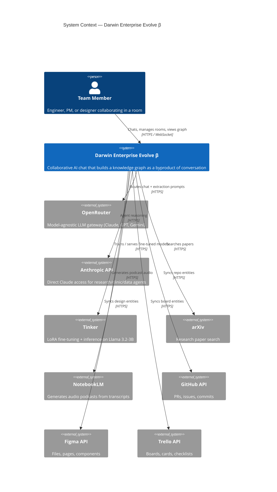
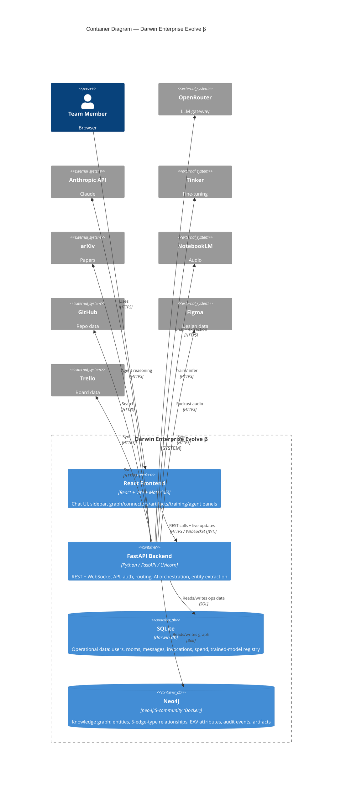

# Darwin Enterprise Evolve β — C4 Architecture Documentation

*Generated from a scan of the live codebase (`backend/`, `frontend/`, root infra). Diagrams use Mermaid; render in any Mermaid-aware Markdown viewer (GitHub, VS Code, Obsidian, mermaid.live).*

---

## 1. The "Why" — Core Business Problem

Engineering teams lose traceability. Requirements, design decisions, PRs, and releases live in scattered tools (chat, Figma, GitHub, Trello, docs), and the *connective reasoning* between them — why a decision was made, what constraint drove it, what it depends on — is never captured. When something changes, nobody can answer "what does this affect?"

**Darwin Enterprise Evolve β solves this by making the knowledge graph a byproduct of normal work.** It is a multi-user AI chat platform where teams collaborate with an AI assistant. Every conversation silently extracts entities and relationships into a Neo4j knowledge graph that links requirements → designs → decisions → PRs → releases. As the README puts it: **"The graph is the product — the AI is just the interface to it."**

The graph is built on the **Enterprise Evolve five-edge-type schema** (Resource, Information, Authority, Constraint, Temporal) plus an EAV temporal pattern, so the same model scales from a single team to a full organizational ontology with no migration. The beta is positioned as the **"wedge product"** — the easy-to-adopt entry point — for the larger Enterprise Evolve vision.

Concrete value delivered: multi-user rooms with role-based access, model-agnostic AI (Claude/GPT/Gemini, switchable per room or per message), automatic entity extraction, artifact generation (PRDs, decision logs, traceability matrices), connector sync from GitHub/Figma/Trello, plus auxiliary AI agents (research, clinic, data-analyst) and an optional fine-tuning loop.

---

## 2. C4 Model

### Level 1 — System Context

Who uses the system and what external services it depends on.

### Level 2 — Container

The deployable/running pieces and the data stores.

### Level 3 — Component (FastAPI Backend internals)

Routers (HTTP/WS entry points) over a service layer, mapped from `backend/routes/` and `backend/services/`.

```mermaid
C4Component
    title Component Diagram — FastAPI Backend

    Container(frontend, "React Frontend", "React", "Client")

    System_Boundary(backend, "FastAPI Backend") {
        Component(mainapp, "main.py", "FastAPI app", "Router registration, WebSocket endpoint, lifespan/init")
        Component(authc, "auth.py", "JWT", "Register/login, token decode, room-access checks")

        Component(rRooms, "routes/rooms", "Router", "Rooms, members, settings, spend")
        Component(rMsgs, "routes/messages", "Router", "Send/list messages, @assistant trigger")
        Component(rArt, "routes/artifacts", "Router", "Generate/list artifacts")
        Component(rConn, "routes/connectors", "Router", "Link GitHub/Figma/Trello")
        Component(rTrain, "routes/training", "Router", "Fine-tuning jobs")
        Component(rClinic, "routes/clinic_agent", "Router", "Clinic agent endpoints")
        Component(rResearch, "routes/research_agent", "Router", "Research agent endpoints")

        Component(sLlm, "services/llm", "Service", "OpenRouter gateway, model selection, invocation logging")
        Component(sGraph, "services/graph", "Service", "Neo4j driver, merge_entity, EAV attrs, relationships")
        Component(sExtract, "services/extractor", "Service", "Post-response entity/relationship extraction (cheap model)")
        Component(sWs, "services/ws_manager", "Service", "WebSocket connection manager / broadcast")
        Component(sAudit, "services/audit", "Service", "Writes audit events to graph")
        Component(sGh, "services/github_connector", "Service", "GitHub → graph")
        Component(sFig, "services/figma_connector", "Service", "Figma → graph")
        Component(sTrello, "services/trello_connector", "Service", "Trello → graph")
        Component(sClinic, "services/clinic_agent", "Service", "Persona-based feature analysis (Claude)")
        Component(sResearch, "services/research_agent", "Service", "arXiv search + newsletter/podcast")
        Component(sPodcast, "services/podcast_audio", "Service", "NotebookLM audio generation")
        Component(sData, "services/data_analyst", "Service", "NL→SQL over CSVs (Claude)")
        Component(sTrainer, "services/tinker_trainer", "Service", "LoRA training via Tinker")
        Component(sInfer, "services/tinker_inference", "Service", "Trained-model inference (OpenRouter fallback)")
        Component(sTData, "services/training_data", "Service", "Builds training sets from graph")
        Component(sPersona, "services/personas", "Service", "Customer persona definitions")
    }

    ContainerDb(sqlite, "SQLite", "darwin.db", "Ops data")
    ContainerDb(neo4j, "Neo4j", "Graph", "Knowledge graph")
    System_Ext(openrouter, "OpenRouter", "")
    System_Ext(anthropic, "Anthropic", "")
    System_Ext(tinker, "Tinker", "")
    System_Ext(extsvc, "GitHub / Figma / Trello / arXiv / NotebookLM", "")

    Rel(frontend, mainapp, "REST + WS", "JWT")
    Rel(mainapp, authc, "Authenticates")
    Rel(mainapp, rRooms, "")
    Rel(mainapp, rMsgs, "")
    Rel(mainapp, rArt, "")
    Rel(mainapp, rConn, "")
    Rel(mainapp, rTrain, "")
    Rel(mainapp, rClinic, "")
    Rel(mainapp, rResearch, "")

    Rel(rMsgs, sLlm, "Generates reply")
    Rel(rMsgs, sExtract, "Extracts entities")
    Rel(rMsgs, sWs, "Broadcasts")
    Rel(rArt, sLlm, "Generates artifact")
    Rel(rConn, sGh, "")
    Rel(rConn, sFig, "")
    Rel(rConn, sTrello, "")
    Rel(rClinic, sClinic, "")
    Rel(rResearch, sResearch, "")
    Rel(rResearch, sPodcast, "")
    Rel(rTrain, sTrainer, "")
    Rel(rTrain, sTData, "")

    Rel(sLlm, openrouter, "HTTPS")
    Rel(sExtract, openrouter, "HTTPS")
    Rel(sInfer, tinker, "HTTPS")
    Rel(sTrainer, tinker, "HTTPS")
    Rel(sClinic, anthropic, "HTTPS")
    Rel(sResearch, anthropic, "HTTPS")
    Rel(sData, anthropic, "HTTPS")
    Rel(sGh, extsvc, "HTTPS")
    Rel(sFig, extsvc, "HTTPS")
    Rel(sTrello, extsvc, "HTTPS")
    Rel(sResearch, extsvc, "HTTPS")
    Rel(sPodcast, extsvc, "HTTPS")

    Rel(sLlm, sqlite, "Logs invocations")
    Rel(authc, sqlite, "Users/rooms")
    Rel(sGraph, neo4j, "Bolt")
    Rel(sExtract, sGraph, "Writes graph")
    Rel(sAudit, sGraph, "Audit events")
```

---

## 3. Folder Structure

High-level map of what lives where.

| Path | Contains |
|------|----------|
| `backend/` | FastAPI application (Python) |
| `backend/main.py` | App entry: router registration, WebSocket endpoint, DB init on startup, CORS |
| `backend/auth.py` | JWT auth — register/login, token decode, room-access checks |
| `backend/db.py` | SQLite initialization + connection helper |
| `backend/darwin.db` | SQLite database file (operational data) |
| `backend/routes/` | HTTP routers: `messages`, `rooms`, `connectors`, `artifacts`, `training`, `clinic_agent`, `research_agent` |
| `backend/services/` | Business logic: `llm`, `graph`, `extractor`, `ws_manager`, `audit`, `personas`, the three connectors (`github`/`figma`/`trello`), the agents (`clinic_agent`, `research_agent`, `data_analyst`), the Tinker stack (`tinker_trainer`, `tinker_inference`, `training_data`), and `podcast_audio` |
| `backend/requirements.txt` | Python dependencies |
| `backend/.env` | All API keys + secrets (gitignored) |
| `frontend/` | React + Vite client |
| `frontend/src/App.jsx` | Root component / app shell |
| `frontend/src/components/` | UI panels: `ChatRoom`, `Sidebar`, `GraphPanel`, `ConnectorsPanel`, `ArtifactsPanel`, `TrainingPanel`, `ClinicAgentPanel`, `ResearchAgentPanel`, `AuthScreen` |
| `frontend/src/api/client.js` | REST API client |
| `frontend/src/hooks/useWebSocket.js` | WebSocket hook for live message/graph updates |
| `frontend/package.json`, `vite.config.js` | Frontend build config |
| `documentation/` | Project docs (`darwin_evolve_beta_completion.md`, `darwin_evolve_beta_addendum.md`, and this C4 doc) |
| `docker-compose.yml` (root) | Neo4j 5-community service (with APOC plugin) |
| `.env` / `.env.example` (root) | Environment variable template + secrets |
| `README.md`, `future.md` (root) | Overview and roadmap |

---

## 4. Third-Party Integrations

### Data stores

| Service | Role | Connection |
|---------|------|-----------|
| **Neo4j** (`neo4j:5-community`, Docker, APOC) | The knowledge graph — entities, 5-edge-type relationships, EAV attributes, audit, artifacts | Bolt (`bolt://localhost:7687`) |
| **SQLite** (`darwin.db`) | Operational data — users, rooms, messages, model invocations, spend, trained-model registry | Local file |

### External APIs & cloud services

| Service | Used by | Purpose | Endpoint / SDK |
|---------|---------|---------|----------------|
| **OpenRouter** | `services/llm`, `services/extractor`, `tinker_inference` (fallback) | Model-agnostic LLM gateway — Claude, GPT-4o, Gemini; per-room/per-message model selection; powers chat + entity extraction | `https://openrouter.ai/api/v1` |
| **Anthropic API** | `research_agent`, `clinic_agent`, `data_analyst` | Direct Claude calls for agent reasoning | `anthropic` SDK (`ANTHROPIC_API_KEY`) |
| **Tinker** | `tinker_trainer`, `tinker_inference` | LoRA fine-tuning + inference on Llama 3.2-3B from graph-derived training data | `tinker` SDK |
| **arXiv** | `research_agent` | Research-paper search + relevance scoring | `arxiv` Python lib |
| **NotebookLM** | `podcast_audio` | Generate audio podcasts from research transcripts | `notebooklm` SDK |
| **GitHub API** | `github_connector` | Sync PRs, issues, commits, branches into the graph | `https://api.github.com` |
| **Figma API** | `figma_connector` | Sync files, pages, components into the graph | `https://api.figma.com/v1` |
| **Trello API** | `trello_connector` | Sync boards, lists, cards, labels, checklists, comments into the graph | `https://api.trello.com/1` |

---

## ⚠️ Security Note (found during scan)

Live secrets are committed to the repository, not just referenced as placeholders:

- `.env.example` (tracked in git) contains a **real-looking OpenRouter API key** rather than a placeholder.
- `services/tinker_trainer.py` and `services/tinker_inference.py` have a **hardcoded Tinker API key** as the `os.getenv` default fallback.

Recommendation: rotate both keys, replace the committed values with placeholders (e.g. `sk-or-...`), and ensure all secrets load from the gitignored `.env` only — never as code defaults or in `.env.example`.

---

*C4 model reference: Context (L1) → Container (L2) → Component (L3). A Level-4 "Code" diagram was omitted as it adds little at this stage; the Component diagram already maps to individual files.*
